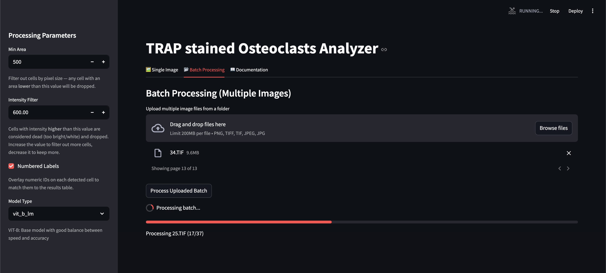
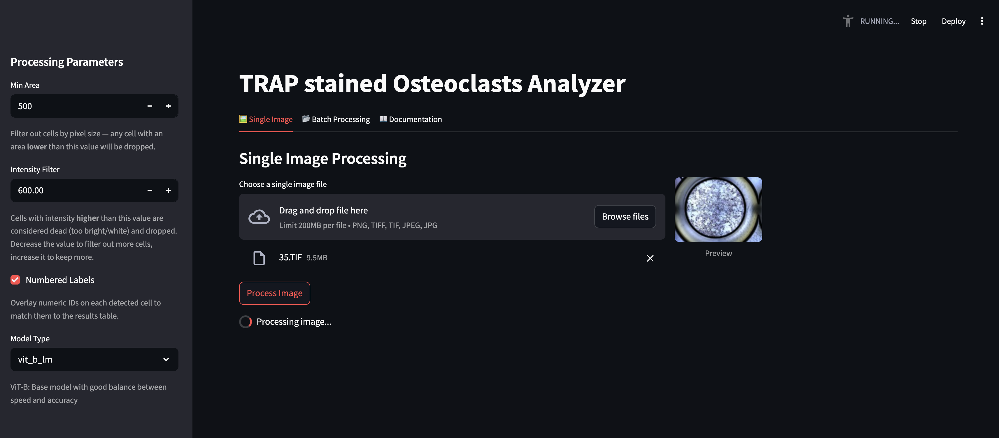
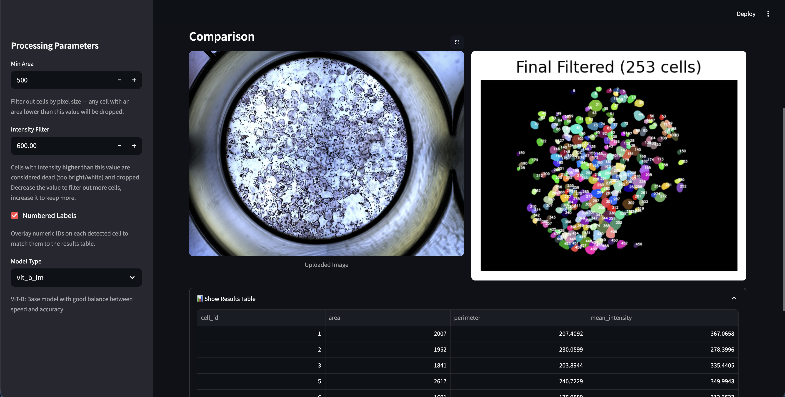
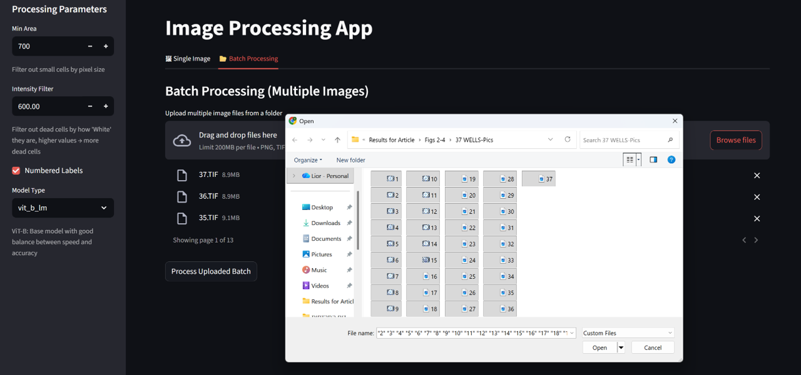
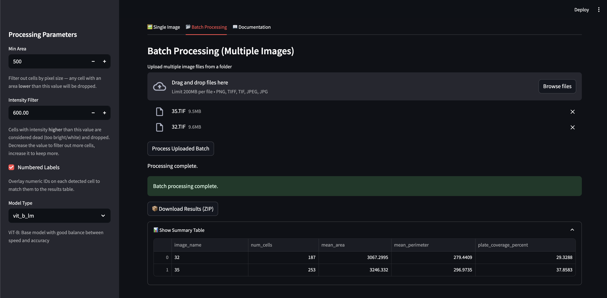
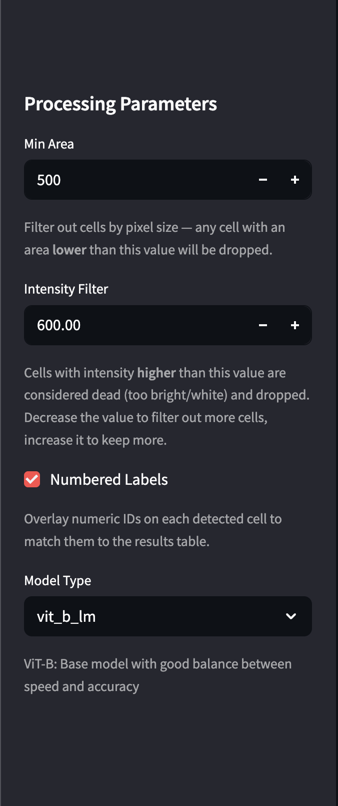

# TRAP-positive Osteoclasts Analyzer

A Streamlit web app for the automated detection and quantitative analysis of
**TRAP-stained osteoclasts** in microscopy images. It uses the
[micro-SAM](https://computational-cell-analytics.github.io/micro-sam/micro_sam.html)
segmentation model to identify individual cells, then measures per-cell
**area** and **confidence**, with optional filtering of small fragments and
over-stained (dead) cells.



---

## Features

- **Single image mode** — upload one image and get an annotated overlay + per-cell table.
- **Batch mode** — process many images at once, download annotated overlays, masks, and a combined `FINAL_STATS.csv`.
- **Adjustable filters** — `Min Area` (drop cells smaller than N pixels) and `Intensity Filter` (drop cells brighter than a threshold).
- **Three SAM backbones** — `vit_t_lm` (fastest), `vit_b_lm` (balanced, default), `vit_l_lm` (most accurate).
- **In-app documentation** — open the 📖 Documentation tab in the running app for a walkthrough.

---

## Installation

This project depends on [micro-SAM](https://computational-cell-analytics.github.io/micro-sam/micro_sam.html),
which is distributed via conda. Follow the official install guide:

👉 **[micro-SAM installation instructions](https://computational-cell-analytics.github.io/micro-sam/micro_sam.html#from-conda)**

In short, after creating the micro-SAM conda environment, install the remaining
Streamlit UI dependencies:

```bash
pip install streamlit matplotlib pandas pillow tqdm
```

Then clone this repo and launch the app:

```bash
git clone https://github.com/shtengel/trap-positive-osteoclats.git
cd trap-positive-osteoclats
streamlit run app2.py
```

---

## Quick start

### 1. Process a single image


1. Open the **🖼 Single Image** tab.
2. Upload a `.png`, `.tif`, or `.jpg`.
3. Adjust the sidebar parameters (see [Parameters](#parameters)).
4. Click **Process Image** and review the side-by-side comparison.



### 2. Process a batch


1. Open the **📂 Batch Processing** tab.
2. Select multiple files at once (Ctrl/⌘-click).
3. Click **Process Uploaded Batch** — a progress bar tracks each image.
4. Download the **📦 results ZIP** containing annotated overlays, masks, and `FINAL_STATS.csv`.



---

## Recommended workflow

Before running a full batch, **calibrate the parameters on a few representative
images** using the Single Image tab:

1. Start with the most permissive values: **`Min Area = 0`** and
   **`Intensity Filter = max`** (so nothing is dropped).
2. Process a handful of representative images.
3. Manually inspect the annotated overlays — note the smallest *true*
   osteoclasts and the brightest *dead/over-stained* cells.
4. Set **`Min Area`** just below the smallest true cell you want to keep.
5. Set **`Intensity Filter`** just above the brightest dead cell you want to drop.
6. Re-run the single-image cases to confirm the filters look correct.
7. Only then switch to **📂 Batch Processing** with the chosen values.

---

## Parameters

All parameters live in the left sidebar.

| Parameter | Description |
|---|---|
| **Min Area** | Drop any cell whose area is **lower** than this pixel count. Increase to remove fragments, decrease to keep small cells. |
| **Intensity Filter** | Drop any cell whose mean intensity is **higher** than this value (treated as over-stained / dead). Increase to filter more aggressively. |
| **Numbered Labels** | Overlay numeric IDs on each detected cell so they can be matched to the results table. |
| **Model Type** | SAM backbone to use — see the [micro-SAM model guide](https://computational-cell-analytics.github.io/micro-sam/micro_sam.html#choosing-a-model). |



---

## Project structure

```
trap-positive-osteoclats/
├── app2.py                              # Streamlit UI (single + batch + docs)
├── osteoclasts_nvtiro_segmentation.py  # Core segmentation logic
├── utilities/                           # Helpers (sorting, utilities)
├── filters/                             # Image preprocessing / filtering
├── segmentation/                        # Segmentation internals
├── preprocess/                          # Preprocessing helpers
├── masks/                               # Cached / sample masks
├── assets/                              # Screenshots for the in-app docs
└── requirements.txt                     # Dependency snapshot
```

---

## License

Released under the [MIT License](LICENSE).
